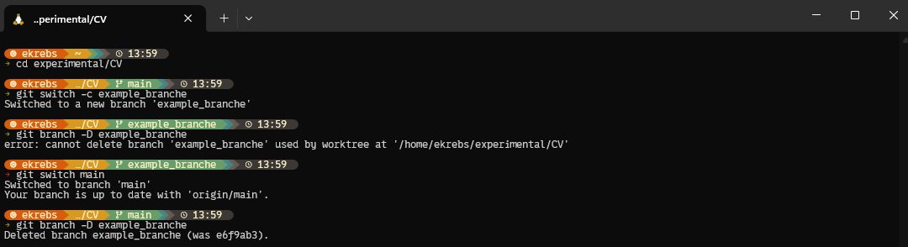

# git-cheat-sheet-for-beginners
git cheat sheet for beginners
# git: git de survie, par MorgenMorg
💀: need to know to be [alive](https://www.youtube.com/watch?v=94RQK400T7k "chanson au pif") (important)

🤟: need to know to be [rock](www.youtube.com/watch?v=94RQK400T7k "chanson au paf") (great)

🛹: need to know to be a [freestyler](https://www.youtube.com/watch?v=ymNFyxvIdaM "chanson au pouf") (optional)

## cloner
- 💀 `git clone`
  - clone une repo à partir de l'url
- 💀 `git pull`
  - recupère les changements et les applique en local
- 🤟 `git fetch`
  - recupère les changements sans les appliquer en local
- quand je travaille à plusieurs: je `pull` ou je `fetch` avant de commencer à travailler

 

## Basics
- 💀 `git status`
  - montre les changements
- 💀 `git restore <fichier|dossier> [fichier|dossier...]`
  - restaurer un fichier modifié à sa dernière version sur le repo distant
- 💀 `git add <fichier|dossier> [fichier|dossier...]`
  - Ajoute le/les fichier(s) ou dossier(s)
- 💀 `git reset <fichier|dossier> [fichier|dossier...]`
  - retirer fichier(s) / dossier(s) qui ont été add
- 💀 `git commit`
  - commit les fichiers ajoutés, vous ouvre l'utilitaire de texte du terminal pour ecrire votre message de commit
    - par défaut, vous aurez sans doute [nano](https://www.nano-editor.org/docs.php)
    - 🛹💡 vous aimerez peut être utiliser un meilleur editeur de texte terminal
    - 🛹 moi j'utilise [nvchad](https://nvchad.com/)
    - 🛹 `git config --global core.editor "<votre_editeur_préféré>"`
    - [image d'exemple](./imgs/nvchad.png "neovim nvchad comme editeur git par défaut")

- `git commit -m "Message"`
  - commit les fichiers ajoutés avec le message
- 💀 `git push`
  - push les fichiers qui ont été commit vers le repo
- 💀 `git log --graph`
  - montre l'historique
    - 🤟 vous aimerez peut être `--all --decorate --oneline --graph` (💡 retenez: *a dog* !)

 
 
 
 

# travail en équipe
## branches
- 💀 `git branch`
  - lister les branches

- 💀 `git switch -c <nouvelle_branche>`
  - crée et va sur la nouvelle branche
    - 💀 au moment de push, git vous indiquera comment push sur votre branche: oui ça fait peur, mais git est très gentil et nous donne la ligne à copier/coller 

- 💀 `git switch <branche_destination>`
  - va sur la destination

- 💀 `git checkout <branche_ou_hash_de_destination>`
  - va sur la destination

- 💀 au début, pour merger, je vous conseil de le faire depuis github 👍
  - 🤟 plus tard, je vous conseil d'apprendre à le faire avec vscode

- 💀 `git branch -D <branche_a_supprimer>`
  - supprimer la branche
    - vous devez vous barrer de la branche avant de pouvoir la supprimer...

- 🤟💡 pour avoir des indications en plus dans votre terminal, je vous conseil d'utiliser [starship](https://starship.rs/), avec [gruvbox, pastelle, ou tokionight...](https://starship.rs/presets/) comme preset

 

## stash
- 🤟 `git stash -m "<nom_du_stash>"`
  - stasher avec un petit nom
- 🤟 `git stash list`
  - lister les stashs avec leurs numéros
- 🤟 `git stash pop <number_to_pop>`
  - appliquer & supprimer le stash n°X
- 🤟 `git stash drop <number_to_drop>`

 

## les tags
un tag sert à pouvoir se substituer au hash du commit pour l'identifier 👍
- 🤟 `git tag -a v1.0.0`
- 🤟 `git tag v1.0.0 -m "Version 1.0.0"`
  - mettre un tag
- 🤟 `git tag -a v1.0.0 <commit-hash>`
- 🤟 `git tag v1.0.0 <commit-hash> -m "Version 1.0.0"`
  - mettre un tag sur un hash précis
- 🤟 `git tag -n`
  - lister les tags
- 🤟 `git push --tags`
  - push les tags
- 🛹 `git tag -f v1.0.0 <commit-hash>`
  - déplacer un tag vers un autre commit
- 🛹 `git tag -d v1.2.0`
  - supprimer un tag local
- 🛹 `git push origin --delete v1.2.0`
  - supprimer un tag du remote 

## inspecter commits
- 🛹 `git diff <hash_du_commit>`
  - montre ce que ce commit a fait par rapport à ton travail local
    - 🛹💡 vous aimerez utiliser [un meilleur diff](https://www.reddit.com/r/commandline/comments/x1pv3z/a_better_git_diff_with_delta/?tl=fr), comme delta en mode couleur, par exemple: 
    - 🛹 installer delta: `sudo apt install delta`
    - 🛹 dire à git d'utiliser delta en mode couleurs pour afficher les différences: `git config --global interactive.diffFilter 'delta --color-only'`

- 🤟 `git show <hash_du_commit>`
  - montre ce que ce commit a fait

 
 
 
 

# Deux mains, trois flingues:
## travailler avec des remotes:
- 🤟 `git remote -v`
  - voir les remotes
- 🤟 `git remote add <nom_nouveau_depot> <git@github.com:username/repo-name.git>`
  - ajouter un remote (depot distant) 
    - sert pour avoir `github` *et* `gitlab` sur ton même git !
  - 🤟 `git push <remote>`
  - 🤟 `git pull <remote>`
  - 🤟 `git fetch <remote>`
    - 🛹💡 configurer ton git pour que ton push envoie sur ton github *et* ton gitlab en même temps
    - 🛹 `git remote set-url --add --push origin git@github.com:TON_USER/mon-repo.git`
    - 🛹 `git remote set-url --add --push origin git@gitlab.com:TON_USER/mon-repo.git`
    - 🛹 `git push`

